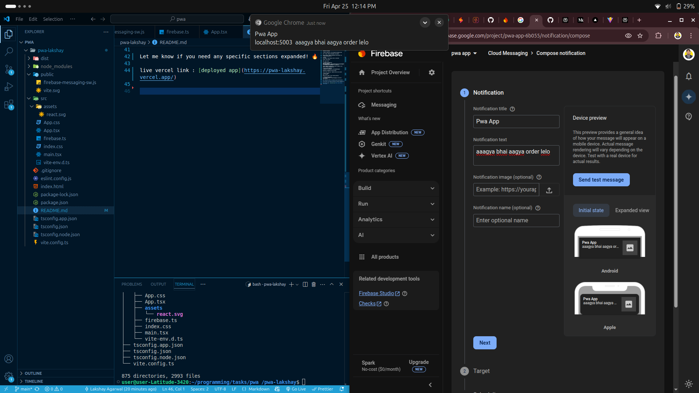
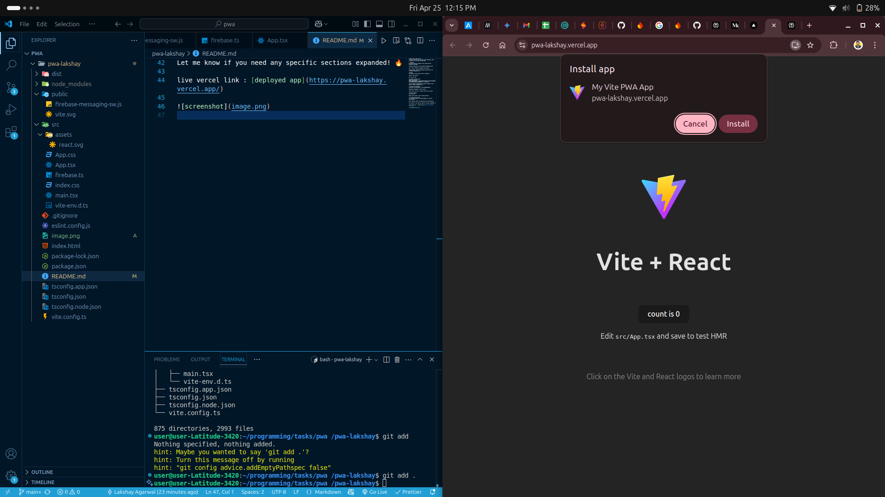
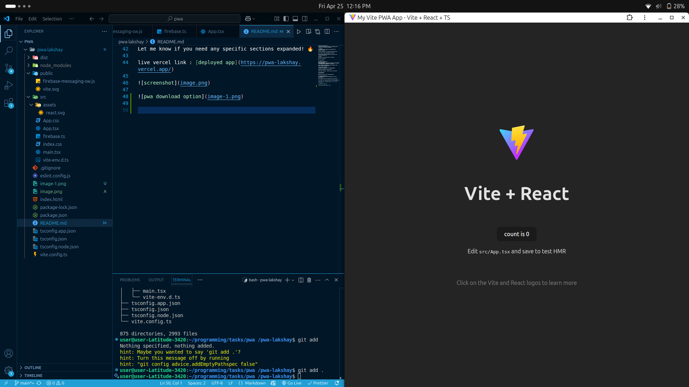

Firebase React PWA Starter
A starter template with Firebase Cloud Messaging (FCM) integration for Progressive Web Apps.

🚀 Features
Push Notifications: Supports both foreground and background messages

Firebase Integration: Pre-configured messaging setup

Vite + React: Modern development environment

Service Worker: Handles background notifications via firebase-messaging-sw.js

🔧 Setup
Environment: Ensure Node.js ≥16 is installed

Install: npm install

Run: npm run dev

🔑 Firebase Configuration
VAPID Key: Replace BI5GjozZKCW82sRk2Bv-jTdRWr4J2Ub9CETxQFnzBzSiS2tGt8LMegB8HrRcLnTVU8WdDcCWq2yfJCjpG2B5J84 in firebase.ts

Config: Update firebaseConfig in both firebase.ts and public/firebase-messaging-sw.js

⚙️ Notification Handling
Foreground: Customizable in onFirebaseMessage()

Background: Managed by service worker

Icons: Uses /vite.svg - replace with your own assets

📦 Build & Deploy
npm run build

Deploy dist folder to your hosting platform

🔍 Testing Notifications
Use Firebase Console → Cloud Messaging to send test notifications

Note: Requires HTTPS for production push notifications

Let me know if you need any specific sections expanded! 🔥

live vercel link : [deployed app](https://pwa-lakshay.vercel.app/)

